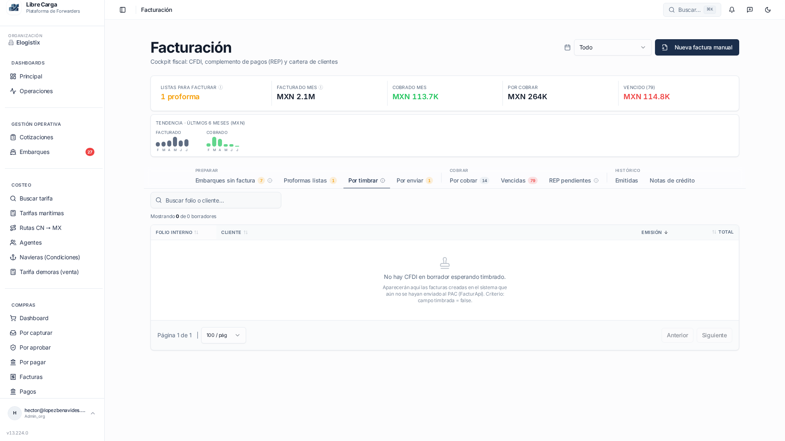
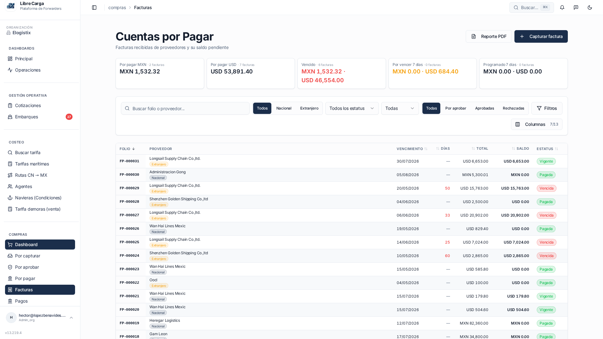
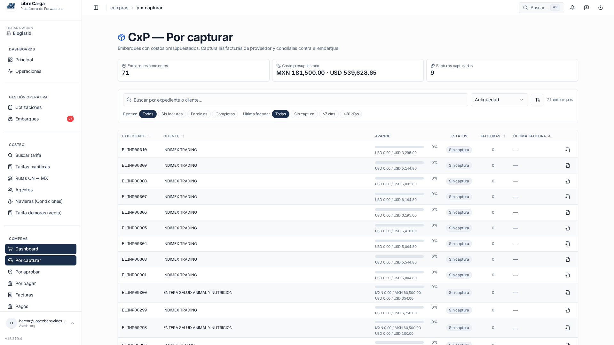

# Capa 3 · Tranche B — /facturacion, /cxp, /por-capturar

**Fecha:** 09/07/2026 · **Viewport:** 1920×1080 · **Rol:** Admin_org (Elogistix)
**Capturas:** `docs/ui-audit/screenshots/{facturacion,cxp,por-capturar}.png`

---

## 1 · /facturacion — "Cockpit fiscal"

### 1.1 · KPI strip mezcla números y mini-chart (MED)
La tira superior tiene 6 tarjetas pero **la 6ª ("Últimos 6 meses · MXN")** es un mini bar-chart doble sin número grande. Rompe la ley de similitud contra las otras 5 tarjetas (label + valor). Efecto: la vista escanea "MXN 2.1M / 113.7K / 264K / 114.8K / F M A M J J" en un mismo renglón y el cerebro no puede alinearlas.

**Fix propuesto:** mover el mini-chart a una tarjeta aparte del bloque de KPIs (fila secundaria) **o** normalizar la tarjeta como sparkline compacta dentro de un `KpiCard` con `label + total del período + sparkline` debajo.
`src/features/facturacion/components/FacturacionKpis.tsx`

### 1.2 · "Listas para facturar 1" sin unidad (LOW)
Único KPI del strip que no tiene moneda ni tipo — solo `1`. Rompe la simetría tipográfica del renglón (todos los demás son `MXN xxx`). Sugerido: mostrar `1 embarque` o mover a un badge fuera del strip financiero.

### 1.3 · Barra de tabs con 3 grupos: densidad excesiva (MED)
`PREPARAR (3 tabs) · COBRAR (3 tabs) · HISTÓRICO (2 tabs)` = **8 tabs en un renglón** con dividers. En 1080 se ve, pero cada label lleva un `?` de tooltip que compite con el badge numérico (`7`, `1`, `14`, `79`).

Problemas concretos:
- El tab activo ("Por timbrar") usa **underline** pero los otros tabs también tienen el `?` con el mismo peso visual — el underline compite con los iconos de info.
- Los tres group labels ("PREPARAR / COBRAR / HISTÓRICO") están en small-caps `text-muted-foreground` pero también son verticales-mid-align con los tabs. Se leen como si fueran tabs también.

**Fix propuesto:**
- Group labels: mover encima como `text-2xs uppercase tracking-wider` en un renglón dedicado, o eliminarlos y usar dividers `border-l` sin texto (más limpio).
- Eliminar el `?` de los tabs que no tienen tooltip real (solo dejarlo en 2-3 estratégicos).
`src/features/facturacion/components/bandejas/BandejaTabs.tsx`

### 1.4 · Empty state OK (referencia)
Icono `Stamp`, título + descripción con el criterio técnico (`timbrada = false`). Este patrón debe replicarse en el resto de tabs vacías.

---

## 2 · /cxp — Cuentas por Pagar

### 2.1 · Breadcrumb dice "Facturas", H1 dice "Cuentas por Pagar" (HIGH)
Breadcrumb: `compras › Facturas`. H1: **"Cuentas por Pagar"**. El sidebar destaca "Facturas". Tres nombres distintos para la misma ruta rompen la ley de consistencia y confunden al usuario cuando comparte URL / navega con back-button.

**Fix propuesto:** unificar a **"Facturas de proveedor"** (que ya está en la memoria `mem://features/modulo-compras`) tanto en breadcrumb, sidebar y H1. El subtítulo puede aclarar "Saldo pendiente por pagar".
`src/features/cxp/routes/CxpFacturas.tsx` + sidebar entry.

### 2.2 · Fila de filtros: 3 tipos de affordance mezclados (HIGH)
Renglón: `[input] [Todos|Nacional|Extranjero segmented] [select Todos los estatus] [select Todas] [Todos|Por aprobar|Aprobadas|Rechazadas segmented] [button Filtros]` + `Columnas 7/13`.

Problemas:
- **Segmented + select para el mismo tipo de filtro:** el segmented ya ofrece "Todos" y el select ofrece "Todas" — el usuario no sabe si son filtros independientes o duplicados.
- Dos labels "Todos" / "Todas" adyacentes sin encabezado — solo diferencia de género. Nada indica qué filtra cada uno.
- El botón "Filtros" al final sugiere que **hay más filtros ocultos** — entonces ¿por qué exponer 4 encima?

**Fix propuesto:**
- Dejar solo un segmented "Nacional / Extranjero / Todos" (dimensión intrínseca de la factura).
- Mover estatus (Vigente/Pagada/Vencida) y aprobación (Por aprobar/Aprobadas/Rechazadas) al popover **"Filtros"**.
- Añadir labels arriba de cada segmented (`Origen`, `Estatus`) si se dejan expuestos.
`src/features/cxp/components/CxpFacturasFilters.tsx`

### 2.3 · KPI tiles con contenido bimoneda inconsistente (MED)
- "Por pagar MXN · 2 facturas · MXN 1,532.32" — 1 moneda.
- "Por pagar USD · 7 facturas · USD 53,891.40" — 1 moneda.
- "Vencido · 6 facturas · MXN 1,532.32 · USD 46,554.00" — **2 monedas concatenadas con `·`**.
- "Por vencer 7 días · 0 facturas · MXN 0.00 · USD 684.40" — 2 monedas.
- "Programado 7 días · 0 facturas · MXN 0.00 · USD 0.00" — 2 monedas.

El separador `·` se usa **tanto para separar campos** ("6 facturas · MXN 1,532") **como para separar monedas** ("MXN 1,532 · USD 46,554"). El ojo no distingue jerarquía.

**Fix propuesto:** dos líneas separadas para las monedas (MXN arriba, USD abajo, con label chico) o normalizar TODOS los KPIs a bimoneda incluso cuando una sea 0.
`src/features/cxp/components/CxpKpis.tsx`

### 2.4 · Badges de estatus: contraste (LOW)
`Vigente` (verde), `Pagada` (verde también), `Vencida` (rojo). **Vigente y Pagada usan el mismo verde** → el ojo no distingue "todavía por pagar" vs "cerrado". Recomiendo Pagada en gris/muted (estado terminal) y Vigente en azul info.
`src/features/cxp/components/EstatusFacturaBadge.tsx`

---

## 3 · /por-capturar — CxP · Por capturar

### 3.1 · Ruido de columnas monocordes (MED)
Con el filtro por defecto ("Todas"), TODAS las filas visibles muestran:
- **Estatus:** `Sin captura` (12 de 12 iguales).
- **Facturas:** `0` (12 de 12 iguales).
- **Última factura:** `—` (12 de 12 iguales).
- **Avance:** `0%` (12 de 12 iguales).

Ocupan ~40% del ancho de la tabla sin aportar información diferenciadora. Ley de proximidad: cuando todo es igual, la columna se vuelve invisible.

**Fix propuesto (dos opciones):**
- **A · Colapsar cuando homogéneo:** si el filtro activo garantiza que la columna es constante (p.ej. filtro `Sin captura` ⇒ Estatus siempre = Sin captura), ocultar la columna y mostrar un chip encima de la tabla que indique el filtro aplicado.
- **B · Mover a densidad compacta:** dejar la fila como `expediente · cliente · progress` grande y meter Estatus/Facturas/Última factura como metadata pequeña dentro de la misma celda de cliente.
`src/features/cxp/porcapturar/PorCapturarTable.tsx`

### 3.2 · Labels de filtros correctos (referencia)
`Estatus:` y `Última factura:` sí llevan label prefix (`text-muted-foreground` antes del segmented). Este patrón **debe replicarse en /cxp §2.2**.

### 3.3 · H1 con icono lucide (referencia)
`CxP — Por capturar` con `Package` iconizado a la izquierda. Patrón correcto ya alineado con `/inicio` post-Lote 3.

### 3.4 · "71 embarques" contador flotante (LOW)
El contador está sobre la caja de búsqueda, alineado a la derecha, sin label ni border. Fácil de perder. Sugerido: moverlo pegado al breadcrumb o convertirlo en badge del H1 (`CxP — Por capturar · 71`).

---

## Resumen y propuesta de lotes

| Bloque | Impacto | Archivos | Descripción |
|---|---|---|---|
| **4a** | HIGH | 2 | §2.1 unificar nombre "Facturas de proveedor" + §2.2 colapsar filtros duplicados en popover |
| **4b** | MED | 3 | §1.1 mini-chart fuera del strip + §1.3 limpiar tabs (grupos + `?`) + §2.3 bimoneda dos líneas |
| **4c** | MED-LOW | 2 | §3.1 opción A (ocultar columnas homogéneas por filtro) + §2.4 Pagada muted |
| **4d** | LOW | 3 | §1.2 unidad en "Listas para facturar" + §3.4 badge contador en H1 + limpieza cosmética |

**Fuera de alcance** (business logic, no UI):
- El KPI "Cobrado mes · MXN 113.7K" en verde vs "Facturado mes · MXN 2.1M": ratio de cobranza 5.4% — probable KPI real, no bug.
- El listado /por-capturar muestra 0% en todos porque no hay facturas capturadas — dato correcto.

**Siguientes pasos**:
1. `aplica Lote 4a` — 2 archivos, HIGH
2. `aplica Lote 4 completo` — 4a+4b+4c+4d, 10 archivos
3. `sigue con Tranche C` — auditar `/clientes`, `/proveedores`, `/agentes` (rutas maestras)
